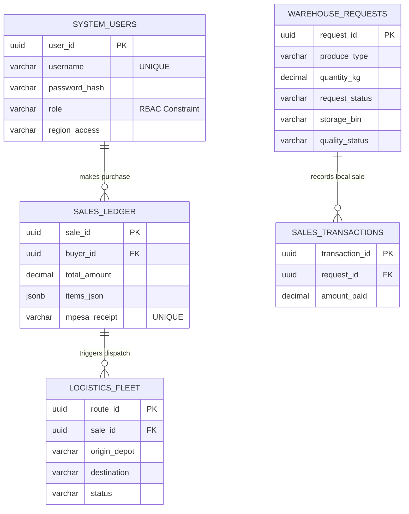

That error occurs because Mermaid is incredibly strict about syntax inside its code blocks. If regular text (like the `*(Note: ...)*` line) accidentally slips inside the ` ```mermaid ` block, or if there is a missing line break before the closing backticks, the GitHub parser crashes. 

Here is the **completely corrected and updated `README.md`**. I have ensured the Mermaid block is perfectly formatted with standard Crow's Foot notation and safely isolated from the text. 

### **Action: Replace your entire `README.md` file with this code:**

```markdown
# 🚜 KAPEM: Kenya Agricultural Produce Exchange Market

> A Distributed, Cloud-Native Database System for Agricultural Supply Chain Logistics.

   

## 📖 Project Overview
KAPEM is a **Distributed Database Management System (DDBMS)** designed to solve fragmentation in agricultural supply chains. It connects autonomous regional production hubs across Kenya into a unified national exchange.

Unlike monolithic systems, KAPEM uses a **Shared-Nothing Architecture** with **Topological Sharding**. Transactions are routed to specific physical PostgreSQL nodes based on the geographic origin of the produce, ensuring high availability, localized low latency, and strict data isolation.

## 🏗 System Architecture
The system is containerized using **Docker** and consists of a Node.js Gateway routing traffic to a 6-node PostgreSQL cluster:

1.  **API Gateway (Middleware):** A Node.js router that performs query decomposition, scatter-gather aggregations, and topological routing.
2.  **HQ Core Node (Nairobi):** Stores global metadata, RBAC (Role-Based Access Control) user credentials, National Logistics dispatch, and the global Financial Ledger.
3.  **Regional Edge Shards (x5):** `kapem_central`, `kapem_rift`, `kapem_western`, `kapem_coast`, `kapem_northern`. These independent databases physically store localized agricultural inventory and warehouse bin assignments.

### 🗄️ Entity-Relationship Diagram (ERD)



*(Note: Cross-database relationships, such as matching a local warehouse request to an HQ sale, are handled programmatically by the Node.js Gateway to maintain strict shard independence).*

## 🚀 Key Features
* **Topological Sharding:** Writes are automatically routed to the correct regional shard based on town metadata.
* **ACID Transactions:** Implements Pessimistic Concurrency Control (`FOR UPDATE`) to prevent inventory race conditions during marketplace checkouts.
* **Context-Aware UI:** The frontend dynamically shapes the navigation and dashboards based on the specific PostgreSQL role payload of the authenticated user.
* **Automated Data Pipelines:** Purchasing produce automatically logs revenue in the HQ ledger, locks the physical bin in the regional shard, and dispatches a truck in the logistics table.

## 🛠️ Tech Stack
* **Infrastructure:** Docker & Docker Compose
* **Database:** PostgreSQL 16 (6-Node Sharded Cluster)
* **Backend:** Node.js (Raw HTTP/PG Gateway - No Heavy Frameworks)
* **Frontend:** Vanilla HTML5, CSS3, JS (Dynamic DOM Injection)

---

## 📦 Local Installation & Setup

### Prerequisites
* Docker Desktop installed and running.
* Node.js (v18+) installed.

### 1. Clone the Repository
```bash
git clone https://github.com/psychesupreme/kapem-distributed-system.git
cd kapem-distributed-system
```

### 2. Boot the Distributed Cluster
Spin up the API gateway and the 6 PostgreSQL nodes using Docker:
```bash
docker-compose up --build -d
```

### 3. Seed the Network
Populate the databases with realistic Kenyan regions, 45 distributed farmers, and 20 enterprise admins:
```bash
node seed_kenya_network.js
```

### 4. Access the System
Open your browser and navigate to `http://localhost:3000`.

**Demo Test Credentials:**
*(Master Password for all users: `password123`)*
* **HQ Director:** `hq_director` (Access to Command Center, Topology Map, Logs)
* **Finance Admin:** `finance_head` (Access to Revenue Analytics)
* **Logistics Admin:** `fleet_commander` (Access to Dispatch Tracker)
* **Central Warehouse Ops:** `nyeri_warehouse` (Access to Bin assignments)
* **Wholesale Buyer:** `nairobi_millers` (Access to Live Market & Order History)
* **Farmer:** `farmer_kamau` (Access to Central Region harvesting)

---

## 🤝 How to Contribute

We welcome contributions as we learn and build together! Follow these steps to submit your code:

1. **Fork the Project:** Click the "Fork" button at the top right of this repository to create a copy on your own GitHub account.
2. **Clone your Fork:** ```bash
   git clone https://github.com/YOUR_USERNAME/kapem-distributed-system.git
   ```
3. **Create a Feature Branch:** ```bash
   git checkout -b feature/AmazingFeature
   ```
4. **Commit your Changes:** ```bash
   git commit -m 'Add some AmazingFeature'
   ```
5. **Push to the Branch:** ```bash
   git push origin feature/AmazingFeature
   ```
6. **Open a Pull Request:** Go back to the original `psychesupreme/kapem-distributed-system` repository and click "Compare & pull request".
```

### **How to Push the Fix:**
Once you have saved the file, run your git commands again:
```bash
git add README.md
git commit -m "fix: Resolve Mermaid ERD parsing error"
git push origin main
```
